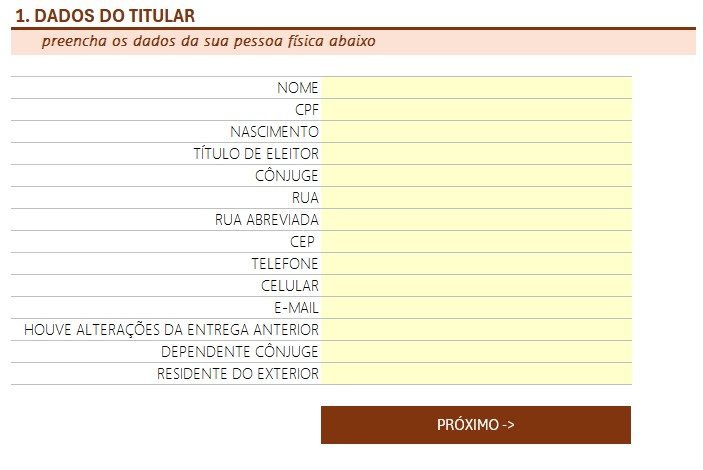
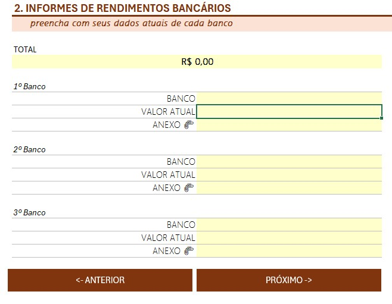
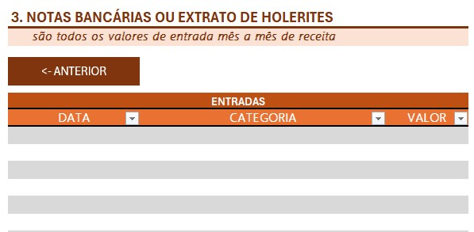

# Organizador de informações para Imposto de Renda / Curso DIO

## 📋 Descrição
O projeto consiste na criação de uma planilha de controle de dados para facilitar a organização de informações necessárias para a declaração de imposto de renda. A ferramenta foi desenvolvida no Excel, utilizando validações de dados, navegação facilitada e funções interativas. Esta planilha é solução prática e profissional para organização de dados fiscais.

## 🚀 Funcionalidades
* **Menu interativo:** Menu interativo para adição de informações pessoais, informes bancários e entradas de receita.

## 🛠️ Tecnologias Utilizadas
* Microsoft Excel 

## 📸 Capturas de Tela
Abaixo estão prints da planilha:

## Autor
[Andreia Pontes]
[www.linkedin.com/in/andreia-cristina-pontes-8a55aa]
